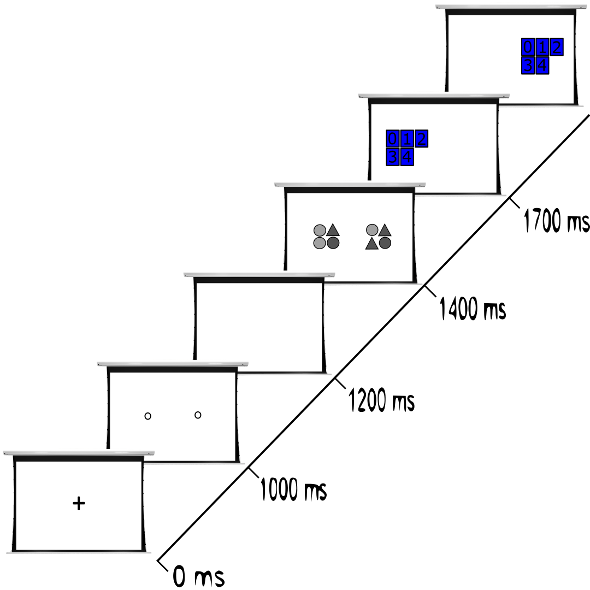

# attentional-window-stimulus
Attentional window stimulus for measure the breadth of attention using the methodology presented in Hüttermann, S., Memmert, D., Simons, D. J., &amp; Bock, O. (2013). Using [Psychtoolbox 3](http://psychtoolbox.org/)

